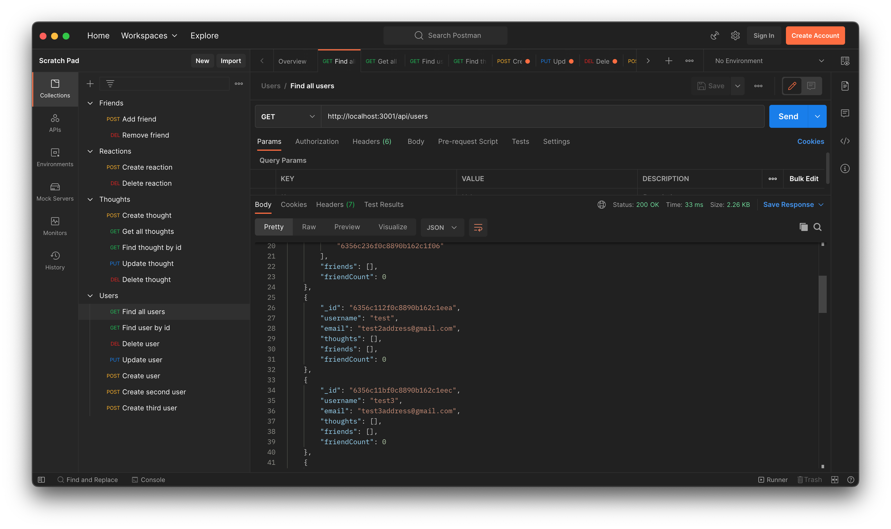

# <Social-Media-Api>

## Description

Using Mongodb and mongoose instead of Mysql and sequilize. I was to make a backend for a social media api. Similar to twitter, it needed to allow the creation of users and the adding of thoughts by the users and a friend/unfriend feature. Was usefull to learn how to use Mongodb for storing this data and more practice with routing.

## Installation

After starting the app in the command line. Try viewing the different routes for users, thoughts, reactions, and friends. You can create, update and delete all of these as well.

## Usage

Using postman all the routes were tested

